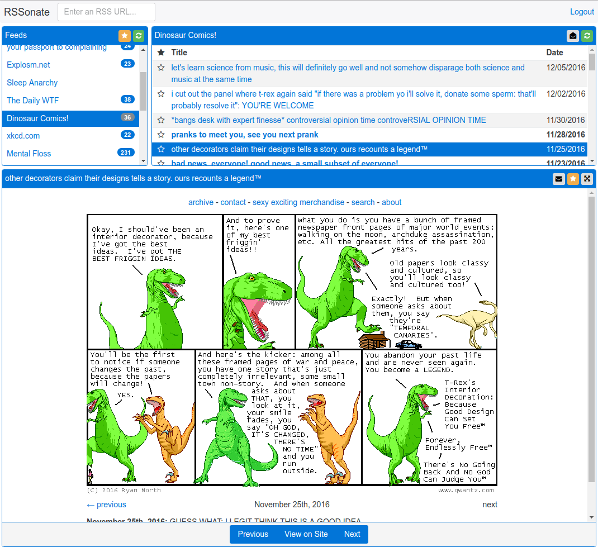

RSSonate
--------

A web-based RSS reader using Ember.js on top of a Django API server.

    cd server
    pip install -r requirements.py
    ./manage.py runserver 0.0.0.0:8000

    cd client
    npm install
    ember serve

    firefox http://localhost:4200

